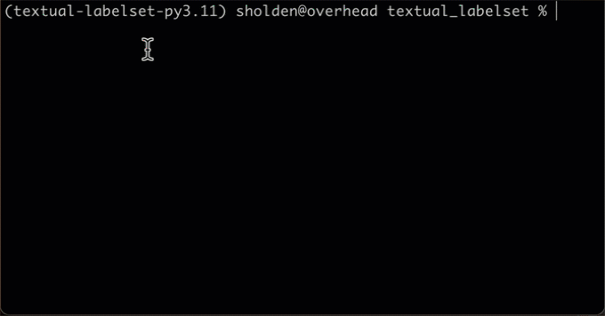

## textual-tagset

A utility to allow easy maintenance of labels/tags
from controlled vocabularies.

### Dependency

Besides the usual Python ecosystem the sole requirement
is [the `poetry` command](https://python-poetry.org/docs/).
Installation is normally straightforward.

### Installation

`textual_tagset` isn't yet available on PyPI, but will be shortly.

We always recommend Python development work is performed
inside a virtual environment.
To create a virtual environment with `textual_tagset` already installed,
from the project's root directory enter

    poetry install

### Usage

A `TagSet` is a set of string tags.
You won't normally use them directly,
but you can create one by calling the `TagSet`
constructor with a dict of string values, each
of which has a unique integer key.
A more convenient API would clearly be helpful,
and will likely emerge shortly.

A `FilteredTagset` has the same interface as a
`TagSet` but uses an `Input` to enter a filter
string value to limit the choices available in
the `TagSet` for ease of selection.

You create a `TagSetSelector` by providing two
dicts, one containing the selected labels and
the other containing the deselected labels.
Note that the keys must be unique across both
dicts.

As you might expect there's also a `FilteredTagSetSelector`,
which uses a `FilteredTagSet` for the unselected values.
The assumption here was that many more items would
remain unselected than _be_ selected,

The default representation shows each tagset
as a variable-height area of selected values
next to a similar area of deselected values.

More documentation will follow on demand.
No demand, no more documentation :).

### Demonstrations and Code Samples

A simple demonstration of each of the classes is available
by using `make`. They should all be terminated with `^C`.
The demos live in _src/textual\_tagset/demo_.

`make demo1` brings up a simple `TagSet`.

`make demo2` shows a `TagSetSelector`.
   Underlined text is clickable, moving an item from one set to the other.

`make demo3` brings up a `FilteredTagSet` - enter text to see only items matching that text.

`make demo4` demonstrates the `FilteredTagSetSelector`, in which the unselected tags
   are filterable though the selected ones are not.

Here's a short video of a `TagSetSelector` in action.

### Development

This code is under construction.
Development work will aim to increase usability:

1. Make sorting somewhat easier to configure (at present
   it uses a slightly bizarre algorithm to sort names correctly).
2. Make it easier to configure the formats used for the selected
   and deselected items.
3. Simplify the API.

