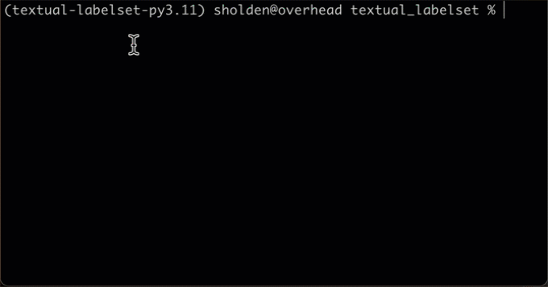

## textual-labelset

A utility to allow easy maintenance of labels/tags
from a controlled vocabulary.

### Installation

`textual_labelset` isn't yet available on PyPI, but will be shortly.

We always recommend Python development work is performed
inside a virtual environment.
To create a virtual environment with `textual_labelset` already installed,
from the project's root directory enter

    poetry install

### Usage

A `LabelSet` is a fixed vocabulary
in which some or all of the values may be selected.
You won't normally use them directly,
but you can create one by calling the `LabelSet`
constructor with two sequences,
one of selected values and the other of
deselected values.

`LabelSet`s are presented internally as dictionaries
in which each label has a unique key.

You create a `LabelSetSelector` by providing two_
sequences, one containing the selected labels and
the other containing the deselected labels.

The default representation shows each labelset
as a variable-height area of selected values
next to a similar area of deselected values.

### Usage example

The following code gives a simple example.

```python
"""
demo.py: show off the features of textual_labelset.
"""
from textual.app import App
from textual_labelset import LabelSetSelector

selected = "Yes Oui Ja".split()
deselected = "No Non Nein".split()

lss = LabelSetSelector(selected, deselected)

class LabelSetApp(App):

    def compose(self):
        yield lss

app = LabelSetApp()

if __name__ == '__main__':
    app.run()
```

With both `textual-dev` and `textual_labelset` installed
you can run it with the command

    textual run textual_labelset.demo

If you created the `poetry` virtual environment,
you can run it in that with the command

    poetry run python src/textual_labelset/demo.py

If the necessary virtualenv is already activated,
you will just need the last two words:

    python src/textual_labelset/demo.py

Here's a short video of the demo in action.


### Development

This code is under construction.
Development work will aim to increase usability:

1. Make sorting somewhat easier to configure (at present
   it uses a slightly bizarre algorithm to sort names correctly).
2. Make it easy to configure the formats used for the selected
   and deselected items.
3. Make it easier to configure the layout of the component
   (or better explain how to).

